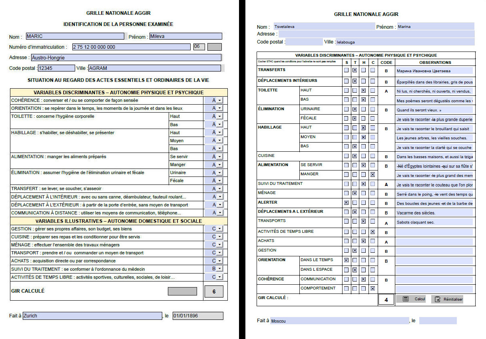

# Aggir
Formulaire PDF grille Aggir avec calcul du Gir

Ceci est un formulaire de grille AGGIR avec le calcul du Gir intégré. Comme il s'agit d'un PDF, il est possible de le remplir, de l'enregistrer, d'y apposer des annotations, de le signer et ceci sur un ordinateur, une tablette ou un smartphone.

Le Gir est calculé automatiquement dès que les 10 variables discriminantes sont renseignées. A chaque modification d'une variable discriminante, le Gir est recalculé. L'algorithme utilisé est celui décrit dans le [décret n°97-427 du 28 avril 1997](https://www.legifrance.gouv.fr/codes/article_lc/LEGIARTI000006684183/) publié au journal officiel du 30 avril 1997.

De même, la clé du numéro de sécurité sociale (Nirpp) est calculée automatiquement.

Le formulaire est proposé en deux versions, avec ou sans les adverbes :

